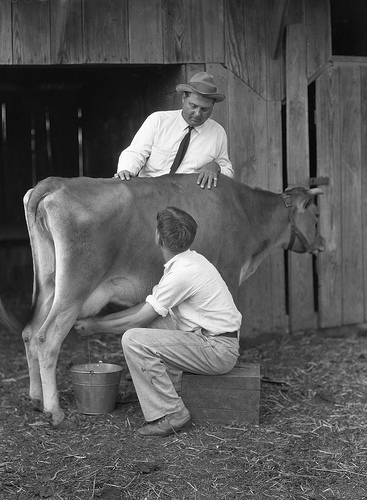
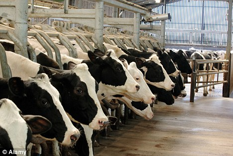
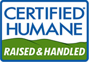
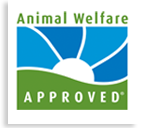

!SLIDE

# A Gentle Guide to
# Ethical Eating

Michael D. Ivey

ivey@gweezlebur.com

@ivey

!SLIDE

My wife, our 3-year old and I have been making careful choices about animal food sources for 3 years

!SLIDE

How did I end up a vegan^W

vegetarian^W

humaneitarian?^W

person who makes careful
choices about animal food sources?

!SLIDE

Emily and I both tried being vegetarians in college for a while, for various reasons, none of them very good.

!SLIDE

It didn't last long.

!SLIDE

Around the time Ellie was born, Emily started paying more attention to where our food came from, especially the animal bits.

!SLIDE

The more we learned, the less animal products we ate.

!SLIDE

# Stuff From Animals

* Steak
* Chicken wings
* Bacon
* Milk
* Eggs
* Honey
* Cheese

!SLIDE

# Surprise! Also Animals

* Cheese (rennet)
* Marshmallows
* Red food coloring
* PopTarts
* Worcestershire sauce
* Sugar
* Bagels

!SLIDE

We eat so much more meat than we used to 50 years ago, and yet we know so much less about where it comes from.

!SLIDE

# Where we think milk comes from

http://www.flickr.com/photos/cushinglibrary/3588643853/

!SLIDE 

# Where milk comes from

## (it's so much worse than this)

http://i.dailymail.co.uk/i/pix/2010/07/01/article-1291060-0881956E000005DC-775_468x313.jpg

!SLIDE

# Feed Lots

"Large beef feedlots are called Concentrated Animal Feeding Operations (CAFOs). They may contain thousands of animals
in an array of pens."

  -- Wikipedia

!SLIDE

# Gestation Crates

"A gestation crate, also known as a sow stall, is a 7 ft by 2 ft metal enclosure used in intensive pig farming, in which
a female breeding pig (sow) may be confined during pregnancy, and in effect for most of her adult life."

  -- Wikipedia

!SLIDE

# Battery Cages

"Battery cages are an industrial agricultural confinement system used primarily for egg-laying hens."

"In the US, the current recommendation by the United Egg Producers is 67 to 86 in^2 [floor space] per bird."

  -- Wikipedia

!SLIDE

# This Slide Intentionally Left Blank

(Because if I show you any pictures you might throw up)

!SLIDE

# Better Choices

* Organic Valley / Organic Prairie
* Cabot
* Springer Mountain Farms
* White Oak Pastures
* Maverick

!SLIDE

Also look for certified organic. It's a start.

!SLIDE

# "Cage Free" is a lie, and "natural" means nothing

!SLIDE

# Start today: reduce

Will Monday be Meatless Monday?

!SLIDE

"According to Environmental Defense, if every American skipped one meal of chicken per week and substituted vegetarian foods instead, the carbon dioxide savings would be the same as taking more than half a million cars off U.S. roads."

!SLIDE

# Don't just swap meat for more cheese

!SLIDE

# Animals aren't machines, or factory parts.
